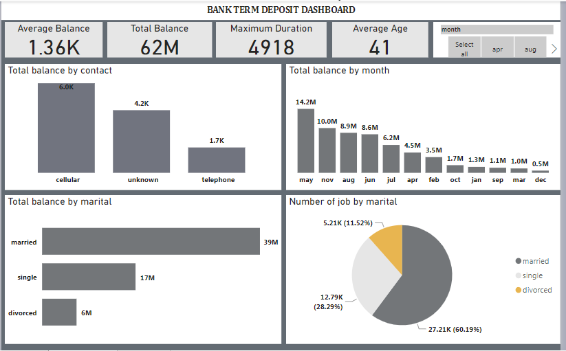

# Dashboard Creation in PowerBI

# Introduction:

A Dashboard is a consolidated view of key metrics and visualiations that provide a snapshot of important information at a glance.Dashboards in powerBI allows users to combine multiple visuals such as charts,tables,and KPI's on a single canvas.Dashboards are interactive and provide the ability to drill down into underlying details or apply filters for deeper analysis.

# Problem Statement:

Create a tracking DASHBOARD for a bank using the "Bank Term Deposit Subsription" Dataset provided.Look up dashboard samples online and use them as a reference to make yours better

# Result/Discussion:

--

# Conclusion:

Creating a dashboard is for the purpose of a better analysis using visuals that a common man can easily understand and relate with hence dashboard is supposed to be simple and not complex,choice of colours has to be kept in place as well.
